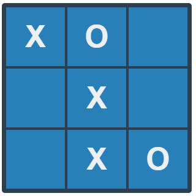

# mvc-tictactoe
A Tic tac toe game made in Javascript using the MVC pattern.

## Built With
- HTML, CSS
- JavaScript

## Author
👤 **Miguel López**

- Github: [@devmiguelopz](https://github.com/devmiguelopz)
- Linkedin: [Miguel López](https://www.linkedin.com/in/miguel-lopez-monzon/)

## 🤝 Contributing
Contributions, issues and feature requests are welcome!

Feel free to check the [issues page](https://github.com/devmiguelopz/mvc-tic-tac-toe/issues/).

## Show your support
Give a ⭐️ if you like this project!

## 📝 License
This project is MIT.
